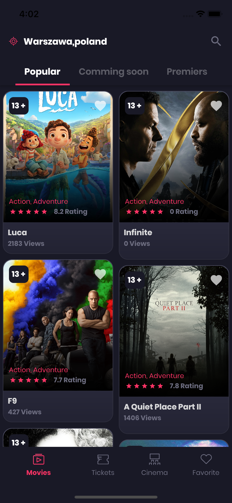
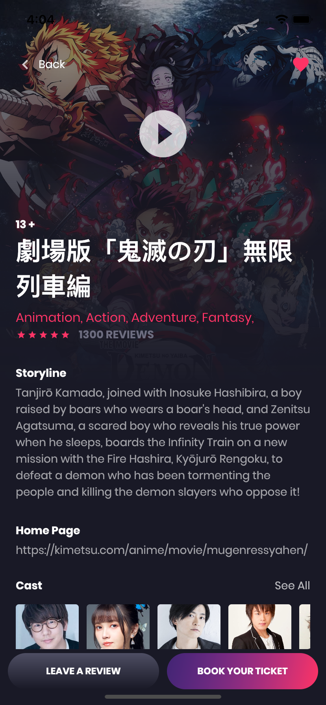
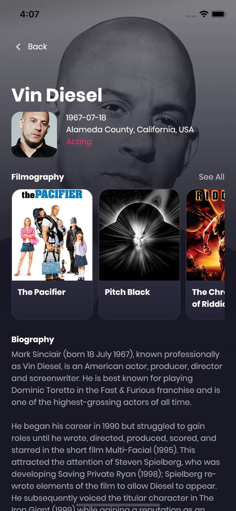
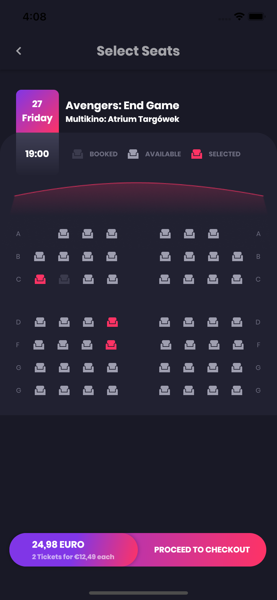

# Movie App

Design Movie App from Figma

## Resource

- [Api the moviedb](#code)
- [Figma design](#code)

## Package

- [flutter_getx](#code)
- [google_fonts](#code)

---

## Screenshoot

## 1. Home Movie

  
 
## 2. Detail Movie

  

## 3. Detail Cast

  

## 4. Select Seats Book

   
